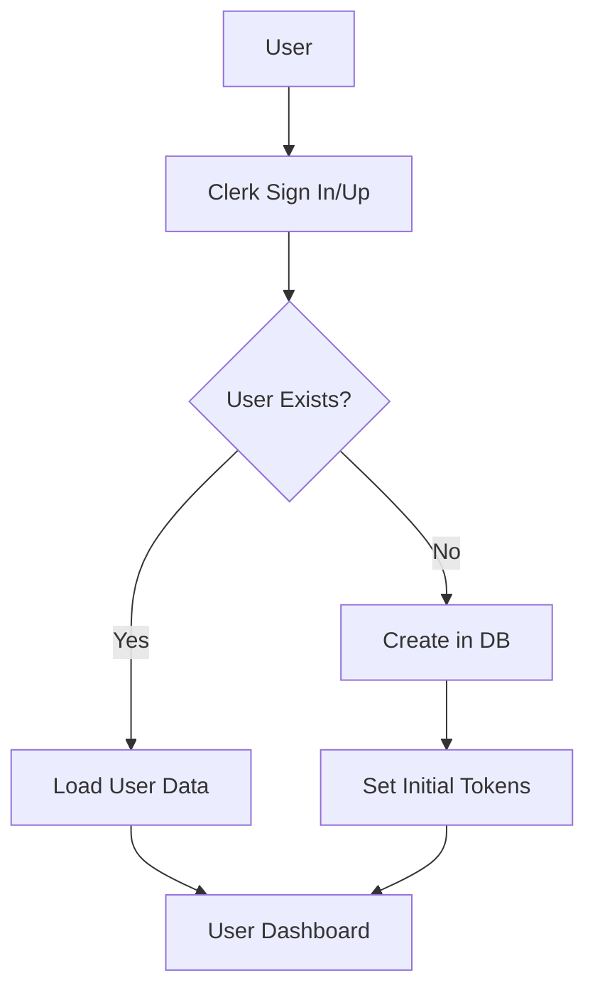
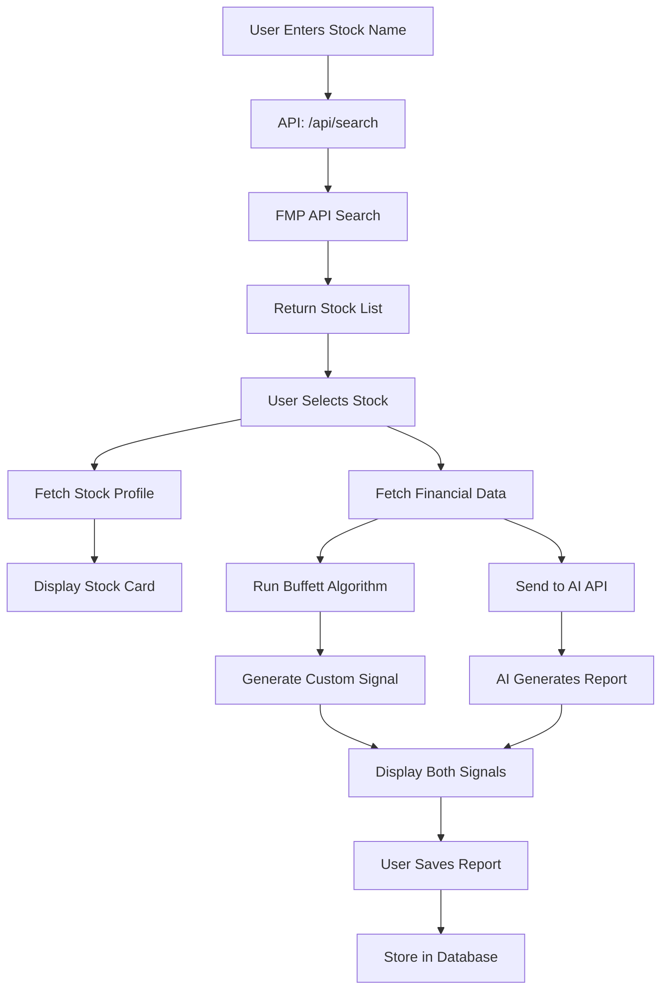
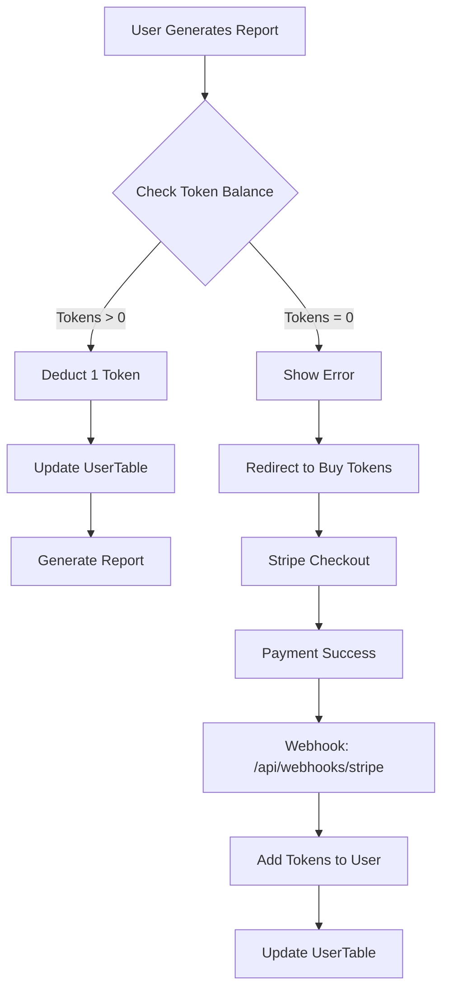

# 📊 AI Investor - Complete Project Architecture & Overview

## 🎯 Project Summary

**AI Investor (Invest Squid)** is a Next.js-based investment analysis platform that provides Warren Buffett-style stock analysis using AI (Claude/Gemini) and custom algorithms. The application fetches financial data, analyzes it using Buffett's investment principles, and provides actionable investment signals (bullish/neutral/bearish).

---

## 📈 Stock Availability

### **Total Stocks Available: 10,000+**

#### Supported Exchanges:
- **NASDAQ** - ~3,500 stocks
- **NYSE** - ~2,800 stocks
- **Total Combined**: **10,000+ publicly traded companies**

#### Coverage Includes:
- All major US stocks (Apple, Microsoft, Google, etc.)
- Mid-cap companies
- Small-cap companies
- ETFs and indices

#### Search Capability:
- Real-time search across all NASDAQ and NYSE listings
- Search by company name or ticker symbol
- Auto-suggestion based on partial matches

**Data Source API:** Financial Modeling Prep (FMP)
- **Free Tier Limit:** 250 API calls per day
- **Endpoint:** `https://financialmodelingprep.com/stable/search-name`
- **Parameters:** `query={stockName}&exchange=NASDAQ,NYSE`

---

## 🏗️ System Architecture

### **Frontend:**
- **Framework:** Next.js 15.2.4 (App Router)
- **UI Framework:** React 19
- **Styling:** TailwindCSS 4 + ShadCN UI components
- **State Management:** Redux Toolkit
- **Animations:** GSAP 3.12.7
- **Type Safety:** TypeScript 5

### **Backend:**
- **API Routes:** Next.js Server Components & Server Actions
- **Database:** Neon PostgreSQL (serverless)
- **ORM:** Drizzle ORM 0.41.0
- **Authentication:** Clerk
- **Payments:** Stripe

### **AI Providers:**
- **Claude 3.7 Sonnet** (Anthropic) - Premium quality
- **Gemini 1.5 Pro** (Google) - Free tier available
- Configurable via `src/lib/ai-config.ts`

### **External APIs:**
1. **Financial Modeling Prep** - Stock data & financials
2. **Claude API** - AI investment analysis
3. **Gemini API** - Alternative AI analysis
4. **Clerk** - User authentication
5. **Stripe** - Payment processing

---

## 📂 Project Structure

```
ai-investor/
├── src/
│   ├── agents/
│   │   └── buffett.ts                    # Buffett algorithm implementation
│   ├── app/
│   │   ├── (auth)/                       # Authentication pages
│   │   │   ├── sign-in/
│   │   │   └── sign-up/
│   │   ├── api/                          # API Routes
│   │   │   ├── buffett/
│   │   │   │   ├── claude/route.ts       # Claude AI endpoint
│   │   │   │   └── gemini/route.ts       # Gemini AI endpoint
│   │   │   ├── financials/[id]/          # Financial data endpoint
│   │   │   ├── search/[name]/            # Stock search endpoint
│   │   │   ├── stock/[id]/               # Stock profile endpoint
│   │   │   ├── reports/                  # Report CRUD operations
│   │   │   ├── tokens/                   # Token balance endpoint
│   │   │   └── webhooks/stripe/          # Stripe webhook handler
│   │   ├── private/                      # Protected routes
│   │   │   ├── search/                   # Stock search page
│   │   │   ├── [stockId]/                # Stock analysis page
│   │   │   ├── list/                     # Saved reports
│   │   │   └── tokens/                   # Buy tokens page
│   │   ├── globals.css                   # Global styles
│   │   ├── layout.tsx                    # Root layout
│   │   └── page.tsx                      # Landing page
│   ├── components/
│   │   ├── stock/                        # Stock-related components
│   │   │   ├── AiReport.tsx              # AI analysis display
│   │   │   ├── AiReportConfidenceChart.tsx
│   │   │   ├── CalculationReport.tsx     # Custom algorithm display
│   │   │   ├── StockCard.tsx             # Stock info card
│   │   │   └── ...
│   │   ├── tokens/
│   │   │   └── BuyTokensCards.tsx        # Pricing cards
│   │   ├── loading/                      # Loading states
│   │   ├── ui/                           # ShadCN components
│   │   └── MobileNavigation.tsx
│   ├── drizzle/
│   │   ├── db.ts                         # Database client
│   │   └── schema.ts                     # Database schema
│   ├── hooks/
│   │   └── useBuffettAiReport.ts         # AI report hook
│   ├── lib/
│   │   ├── ai-config.ts                  # AI provider configuration
│   │   └── utils.ts                      # Utility functions
│   ├── redux/
│   │   ├── slices/
│   │   │   ├── stockDataSlice.ts         # Stock data state
│   │   │   └── tokensSlice.ts            # Token state
│   │   └── store.ts                      # Redux store
│   ├── server/
│   │   └── actions/
│   │       ├── stripe.ts                 # Stripe actions
│   │       └── tokens.ts                 # Token operations
│   ├── types/                            # TypeScript types
│   ├── utils/                            # Helper functions
│   └── middleware.ts                     # Clerk middleware
├── public/                               # Static assets
├── .env.local                            # Environment variables (not in repo)
├── .env.example                          # Environment template
├── package.json
├── drizzle.config.ts                     # Drizzle configuration
├── next.config.ts
└── tsconfig.json
```

---

## 🗄️ Database Schema

### **Tables:**

#### 1. **UserTable** (`user`)
```typescript
{
  id: text,              // Clerk User ID (unique)
  email: text,
  createdAt: timestamp,
  tokens: integer        // Token balance
}
```

**Purpose:** Store user profiles and token balances

#### 2. **ListItemTable** (`listItem`)
```typescript
{
  id: text (PK),
  userId: text,          // Foreign key to user
  createdAt: timestamp,
  stockName: text,
  reasoning: text,       // AI reasoning
  signal: text,          // bullish/neutral/bearish
  confidence: text,
  calculationData: jsonb,  // Full analysis data
  investor: text         // AI provider used
}
```

**Purpose:** Store saved investment reports
**Index:** `userIdCloseDateIndex` on (userId, createdAt)

#### 3. **TransactionsTable** (`transactions`)
```typescript
{
  id: uuid (PK),
  userId: text,
  createdAt: timestamp,
  plan: text             // "5", "10", or "20"
}
```

**Purpose:** Store purchase history

---

## 🔄 Complete Data Flow

### **1. User Authentication Flow**



**Steps:**
1. User clicks "Sign In" → Clerk modal opens
2. User authenticates via Clerk
3. Middleware checks auth status
4. If new user, create entry in `UserTable`
5. Load user's token balance
6. Redirect to `/private/search`

---

### **2. Stock Search & Analysis Flow**



**Detailed Steps:**

#### **Step 1: Stock Search**
- **User Action:** Types stock name in search box
- **API Call:** `POST /api/search/[name]`
- **External API:** FMP Search API
- **Returns:** List of matching stocks (name, ticker, exchange)

#### **Step 2: Stock Selection**
- **User Action:** Clicks on a stock
- **Redirect:** `/private/[stockId]` (e.g., `/private/AAPL`)
- **Parallel API Calls:**
  1. `/api/stock/[id]` - Stock profile (price, market cap, description)
  2. `/api/financials/[id]` - Financial statements (5 years)

#### **Step 3: Data Processing**
- **Custom Algorithm:** `src/agents/buffett.ts` runs locally
  - Analyzes 5 key metrics (fundamentals, consistency, moat, management, intrinsic value)
  - Generates signal (bullish/neutral/bearish)
  - Calculates confidence score
- **AI Analysis:** Sends filtered data to AI endpoint
  - Endpoint: `/api/buffett/gemini` or `/api/buffett/claude`
  - AI generates Buffett-style reasoning
  - Returns JSON: `{signal, confidence, reasoning}`

#### **Step 4: Display Results**
- **Left Panel:** Custom algorithm report
- **Right Panel:** AI report with reasoning
- **Both show:** Signal, confidence, detailed analysis

#### **Step 5: Save Report (Optional)**
- **User Action:** Clicks "Save to List"
- **API Call:** `POST /api/reports/save-report`
- **Database:** Insert into `ListItemTable`

---

### **3. Token System Flow**



**Token Pricing:**
- **$5** → 50 tokens (10¢ per report)
- **$10** → 200 tokens (5¢ per report) ⭐ Popular
- **$20** → 500 tokens (4¢ per report)

**Token Deduction Points:**
1. `/api/buffett/claude/route.ts` (lines 42-49)
2. `/api/buffett/gemini/route.ts` (lines 42-49)

**Token Addition:**
- Stripe webhook calls `createTransaction()`
- `createTransaction()` calls `updateTokens()`
- `updateTokens()` adds tokens based on plan

---

## 🤖 AI Integration Architecture

### **Configuration: `src/lib/ai-config.ts`**

```typescript
export const AI_CONFIG = {
    provider: 'gemini',  // or 'claude'
    
    endpoints: {
        claude: '/api/buffett/claude',
        gemini: '/api/buffett/gemini',
    },
    
    models: {
        claude: 'Claude 3.7 Sonnet',
        gemini: 'Gemini 1.5 Pro',
    }
}
```

### **Claude Integration** (`/api/buffett/claude`)

**Request:**
```json
{
  "ticker": "AAPL",
  "analysisData": {
    "fundamentalAnalysis": {...},
    "consistencyAnalysis": {...},
    "moatAnalysis": {...},
    "managementAnalysis": {...},
    "intrinsicValueAnalysis": {...}
  }
}
```

**Model:** `claude-3-7-sonnet-20250219`
**Pricing:** ~$3 per million tokens
**Response Time:** 3-6 seconds

**Response:**
```json
{
  "content": [{
    "type": "text",
    "text": "{\"signal\":\"bullish\",\"confidence\":85,\"reasoning\":\"...\"}"
  }]
}
```

### **Gemini Integration** (`/api/buffett/gemini`)

**Request:** Same as Claude

**Model:** `gemini-1.5-pro`
**Pricing:** FREE (1,500 requests/day)
**Response Time:** 2-4 seconds

**Response:**
```json
{
  "content": [{
    "type": "text",
    "text": "{\"signal\":\"bullish\",\"confidence\":85,\"reasoning\":\"...\"}"
  }]
}
```

**Key Feature:** `responseMimeType: "application/json"` ensures structured output

---

## 📡 Complete API Reference

### **1. Stock Search**
```
GET /api/search/[name]
```

**Parameters:**
- `name` (path): Stock name or partial name

**External Call:**
```
GET https://financialmodelingprep.com/stable/search-name
  ?query={stockName}
  &exchange=NASDAQ,NYSE
  &apikey={FMP_API_KEY}
```

**Response:**
```json
[
  {
    "symbol": "AAPL",
    "name": "Apple Inc.",
    "currency": "USD",
    "stockExchange": "NASDAQ",
    "exchangeShortName": "NASDAQ"
  }
]
```

---

### **2. Stock Profile**
```
GET /api/stock/[id]
```

**Parameters:**
- `id` (path): Stock ticker symbol

**External Call:**
```
GET https://financialmodelingprep.com/stable/profile
  ?symbol={stockId}
  &apikey={FMP_API_KEY}
```

**Response:**
```json
[
  {
    "symbol": "AAPL",
    "price": 189.50,
    "beta": 1.24,
    "volAvg": 54000000,
    "mktCap": 2950000000000,
    "lastDiv": 0.96,
    "range": "164.08-199.62",
    "changes": 2.15,
    "companyName": "Apple Inc.",
    "currency": "USD",
    "cik": "0000320193",
    "isin": "US0378331005",
    "cusip": "037833100",
    "exchange": "NASDAQ",
    "exchangeShortName": "NASDAQ",
    "industry": "Consumer Electronics",
    "website": "https://www.apple.com",
    "description": "Apple Inc. designs...",
    "ceo": "Timothy D. Cook",
    "sector": "Technology",
    "country": "US",
    "fullTimeEmployees": "164000",
    "phone": "14089961010",
    "address": "One Apple Park Way",
    "city": "Cupertino",
    "state": "CA",
    "zip": "95014",
    "image": "https://financialmodelingprep.com/image-stock/AAPL.png",
    "ipoDate": "1980-12-12"
  }
]
```

**Caching:** 24 hours (86400 seconds)

---

### **3. Financial Statements**
```
GET /api/financials/[id]
```

**Parameters:**
- `id` (path): Stock ticker symbol

**External Call:**
```
GET https://financialmodelingprep.com/stable/financial-statement-full-as-reported
  ?symbol={stockId}
  &limit=5
  &apikey={FMP_API_KEY}
```

**Response:** Complete financial statements (5 years)
- Income Statement
- Balance Sheet
- Cash Flow Statement

**Caching:** 24 hours

---

### **4. AI Analysis (Claude)**
```
POST /api/buffett/claude
```

**Headers:**
```
Content-Type: application/json
Cookie: __session={clerk_session}
```

**Request Body:**
```json
{
  "ticker": "AAPL",
  "analysisData": {
    "fundamentalAnalysis": {
      "score": 7,
      "maxScore": 7,
      "details": ["..."]
    },
    "consistencyAnalysis": {...},
    "moatAnalysis": {...},
    "managementAnalysis": {...},
    "intrinsicValueAnalysis": {...},
    "score": 15.5,
    "maxScore": 18,
    "signal": "bullish",
    "marketCap": 2950000000000,
    "marginOfSafety": 0.45
  }
}
```

**Response:**
```json
{
  "content": [{
    "type": "text",
    "text": "{\"signal\":\"bullish\",\"confidence\":85,\"reasoning\":\"I'm particularly impressed with Apple's consistent ROE above 150%, reminiscent of our See's Candies investment...\"}"
  }]
}
```

**Authentication:** Required (Clerk)
**Token Cost:** 1 token

---

### **5. AI Analysis (Gemini)**
```
POST /api/buffett/gemini
```

Same as Claude endpoint, different AI model

---

### **6. Reports - Get All**
```
GET /api/reports/get-all-reports
```

**Authentication:** Required

**Response:**
```json
{
  "success": true,
  "reports": [
    {
      "id": "uuid-...",
      "created": "2025-01-20T10:30:00Z",
      "name": "Apple Inc.",
      "investor": "gemini",
      "signal": "bullish"
    }
  ]
}
```

**Limit:** 50 most recent reports
**Sorting:** Descending by createdAt

---

### **7. Reports - Get By ID**
```
GET /api/reports/get-report-by-id/[id]
```

**Parameters:**
- `id` (path): Report UUID

**Response:**
```json
{
  "success": true,
  "report": {
    "id": "uuid-...",
    "userId": "user_...",
    "stockName": "Apple Inc.",
    "signal": "bullish",
    "confidence": "85",
    "reasoning": "...",
    "calculationData": {...},
    "investor": "gemini",
    "createdAt": "2025-01-20T10:30:00Z"
  }
}
```

---

### **8. Reports - Save**
```
POST /api/reports/save-report
```

**Request Body:**
```json
{
  "stockName": "Apple Inc.",
  "signal": "bullish",
  "confidence": "85",
  "reasoning": "...",
  "reportData": {...},
  "investor": "gemini"
}
```

**Response:**
```json
{
  "success": true,
  "reportId": "uuid-..."
}
```

---

### **9. Reports - Delete**
```
DELETE /api/reports/delete/[id]
```

**Parameters:**
- `id` (path): Report UUID

**Response:**
```json
{
  "success": true,
  "message": "Report deleted successfully"
}
```

---

### **10. Tokens - Get Balance**
```
GET /api/tokens
```

**Authentication:** Required

**Response:**
```json
{
  "success": true,
  "tokens": 100
}
```

---

### **11. Stripe - Checkout**
```
Server Action: checkoutCredits()
```

**Parameters:**
```typescript
{
  plan: "5" | "10" | "20",
  buyerId: string
}
```

**Process:**
1. Create Stripe checkout session
2. Redirect to Stripe payment page
3. On success, redirect to `/private/tokens?success=true`
4. On cancel, redirect to `/private/tokens?canceled=true`

---

### **12. Stripe - Webhook**
```
POST /api/webhooks/stripe
```

**Event:** `checkout.session.completed`

**Process:**
1. Verify webhook signature
2. Extract metadata (plan, credits, buyerId)
3. Call `createTransaction()`
4. Add tokens to user via `updateTokens()`

---

## 🧮 Buffett Algorithm Deep Dive

### **File:** `src/agents/buffett.ts`

### **Analysis Methodology:**

#### **1. Fundamental Analysis** (7 points max)
```typescript
Criteria:
- ROE > 15% → +2 points
- Debt-to-Equity < 0.5 → +2 points
- Operating Margin > 15% → +2 points
- Current Ratio > 1.5 → +1 point
```

#### **2. Consistency Analysis** (3 points max)
```typescript
Criteria:
- Consistent earnings growth (all periods increasing) → +3 points
- Long-term growth rate calculation
```

#### **3. Economic Moat Analysis** (3 points max)
```typescript
Criteria:
- Stable ROE > 15% (3+ periods) → +1 point
- Stable Operating Margin > 15% (3+ periods) → +1 point
- Both criteria met → +1 bonus point
```

#### **4. Management Quality** (2 points max)
```typescript
Criteria:
- Share buybacks (negative issuance) → +1 point
- Dividend payments → +1 point
```

#### **5. Intrinsic Value Calculation**
```typescript
Formula:
- Owner Earnings = Net Income + Depreciation - (CapEx * 0.75)
- DCF with 10-year projection
- Growth Rate: 5% (conservative)
- Discount Rate: 9%
- Terminal Multiple: 12x
```

### **Signal Generation:**

```typescript
if (score >= 70% of maxScore && marginOfSafety >= 30%) {
  signal = "bullish"
} else if (score <= 30% of maxScore || marginOfSafety < -30%) {
  signal = "bearish"
} else {
  signal = "neutral"
}
```

**Margin of Safety:** `(intrinsicValue - marketCap) / marketCap`

---

## 🎨 Frontend Components

### **Key Components:**

#### **1. StockCard** (`components/stock/StockCard.tsx`)
- Displays stock profile information
- Shows company logo, name, price, market cap
- Includes "Save to List" functionality
- GSAP animations for scroll effects

#### **2. AiReport** (`components/stock/AiReport.tsx`)
- Displays AI-generated analysis
- Dynamic provider icon (Claude/Gemini)
- Shows signal, confidence, and reasoning
- Typing animation for new reports

#### **3. CalculationReport** (`components/stock/CalculationReport.tsx`)
- Displays custom algorithm analysis
- Shows all 5 analysis categories
- Expandable sections for detailed metrics
- Visual score representation

#### **4. BuyTokensCards** (`components/tokens/BuyTokensCards.tsx`)
- Three pricing tiers
- Stripe checkout integration
- Success/cancel toast notifications

#### **5. MobileNavigation** (`components/MobileNavigation.tsx`)
- Responsive navigation menu
- Token balance display
- Sign out functionality

---

## 🔐 Authentication & Middleware

### **Clerk Integration:**

**Middleware:** `src/middleware.ts`

```typescript
export default clerkMiddleware((auth, req) => {
  // Protect all /private routes
  if (req.nextUrl.pathname.startsWith('/private')) {
    auth().protect()
  }
})

publicRoutes: ["/", "/sign-in", "/sign-up"]
```

**User Session:**
- Stored in `__session` cookie
- Automatically managed by Clerk
- Refreshed on each request

---

## 💳 Payment System

### **Stripe Integration:**

**Flow:**
1. User clicks "Buy Tokens"
2. `checkoutCredits()` server action called
3. Stripe session created with metadata
4. User redirects to Stripe checkout
5. On payment success, Stripe sends webhook
6. Webhook handler verifies signature
7. `createTransaction()` logs transaction
8. `updateTokens()` adds tokens to user

**Security:**
- Webhook signature verification
- Server-side only operations
- No client-side token manipulation

---

## 📊 State Management (Redux)

### **Stock Data Slice** (`redux/slices/stockDataSlice.ts`)
```typescript
State:
- stockDataForUi: StockProfile[]
- stockDataForBuffettCalc: AnalysisDataResult | null
```

### **Tokens Slice** (`redux/slices/tokensSlice.ts`)
```typescript
State:
- tokens: number

Actions:
- spentOneToken(): Decrements token count
```

---

## 🧪 Testing the Application

### **1. Environment Setup**
```bash
# Copy environment template
cp .env.example .env.local

# Fill in API keys
GEMINI_API_KEY=AIzaSy...
CLERK_PUBLISHABLE_KEY=pk_test...
CLERK_SECRET_KEY=sk_test...
DATABASE_URL=postgresql://...
FMP_API_KEY=...
STRIPE_SECRET_API_KEY=sk_test...
NEXT_PUBLIC_PUBLISHABLE_STRIPE_API_KEY=pk_test...
STRIPE_WEBHOOK_SECRET=whsec_...
NEXT_PUBLIC_SERVER_URL=http://localhost:3000
```

### **2. Database Setup**
```bash
npm run db:generate
npm run db:migrate
```

### **3. Run Development Server**
```bash
npm run dev
```

### **4. Test Flow:**

1. **Sign Up:** Create account at `/sign-up`
2. **Search Stock:** Type "Apple" in search
3. **Analyze Stock:** Click on AAPL
4. **Wait for Analysis:** Both reports generate
5. **Save Report:** Click "Save to List"
6. **View Saved Reports:** Navigate to "My List"
7. **Buy Tokens:** Go to Tokens page, test with Stripe test card

**Stripe Test Card:**
```
Number: 4242 4242 4242 4242
Expiry: Any future date
CVC: Any 3 digits
```

---

## 📈 Performance Optimizations

### **1. Caching:**
- **Session Storage:** AI reports cached by ticker
- **Next.js Cache:** Stock data cached for 24 hours
- **Prevents:** Redundant API calls

### **2. Lazy Loading:**
- Dynamic imports for heavy components
- Code splitting per route

### **3. Server Components:**
- Most rendering happens server-side
- Reduced JavaScript bundle size

### **4. Database Indexing:**
- Index on `(userId, createdAt)` for reports
- Fast query performance

---

## 🚨 Error Handling

### **Common Errors:**

#### **1. "Publishable key not valid"**
- **Cause:** Missing or incorrect Clerk API key
- **Fix:** Check `.env.local` CLERK keys

#### **2. "You don't have enough tokens"**
- **Cause:** Token balance = 0
- **Fix:** Buy tokens or reset via SQL

#### **3. "Failed to fetch stock data"**
- **Cause:** FMP API limit reached (250/day) or invalid ticker
- **Fix:** Wait 24 hours or upgrade FMP plan

#### **4. "AI is busy"**
- **Cause:** AI provider rate limiting (Gemini: 15/min, 1500/day)
- **Fix:** Wait and retry, or switch providers

---

## 🔒 Security Considerations

### **1. Environment Variables:**
- Never commit `.env.local`
- Use different keys for dev/production
- Rotate keys if exposed

### **2. API Route Protection:**
- All `/api/buffett` routes check authentication
- Token validation on each request
- No client-side API keys

### **3. Database Security:**
- Connection string includes SSL
- User data isolated by Clerk ID
- No SQL injection (using Drizzle ORM)

### **4. Payment Security:**
- Stripe handles all payment data
- Webhook signature verification
- Server-side only token updates

---

## 📊 Key Metrics & Limits

### **API Rate Limits:**

| Service | Free Tier Limit | Cost Beyond |
|---------|----------------|-------------|
| **FMP** | 250 calls/day | $14/month for 750/day |
| **Gemini** | 1,500 calls/day<br>15 calls/min | Paid tier via Google Cloud |
| **Claude** | No free tier | ~$3 per 1M tokens |
| **Clerk** | 5,000 MAU | $25/month for 10,000 MAU |
| **Neon** | 0.5 GB storage | $19/month for 10 GB |

### **Application Limits:**

- **Saved Reports per User:** Unlimited (database constraint)
- **Report History:** Last 50 shown
- **Financial Data:** 5 years of statements
- **Search Results:** All matching stocks returned

---

## 🎯 Future Enhancements

### **Potential Features:**

1. **More Investor Styles:**
   - Peter Lynch algorithm
   - Benjamin Graham algorithm
   - Ray Dalio principles

2. **Advanced Analytics:**
   - Portfolio tracking
   - Watchlists with price alerts
   - Comparison tool (multiple stocks)

3. **Social Features:**
   - Share reports
   - Community discussions
   - Follow other investors

4. **Mobile App:**
   - React Native version
   - Push notifications

---

## 📚 Additional Resources

### **Documentation Files:**

1. **API_SETUP_GUIDE.md** - How to get all API keys
2. **SWITCHING_AI_PROVIDERS.md** - Claude vs Gemini guide
3. **SETUP_SUMMARY.md** - Quick setup overview
4. **README.md** - Project introduction

### **External Documentation:**

- [Next.js Docs](https://nextjs.org/docs)
- [Drizzle ORM](https://orm.drizzle.team/)
- [Clerk Auth](https://clerk.com/docs)
- [Stripe API](https://stripe.com/docs/api)
- [FMP API](https://site.financialmodelingprep.com/developer/docs)
- [Gemini API](https://ai.google.dev/docs)
- [Claude API](https://docs.anthropic.com/)

---

## ✅ Summary

### **Core Capabilities:**

✅ **Stock Coverage:** 10,000+ stocks (NASDAQ + NYSE)  
✅ **AI Analysis:** Dual provider support (Claude + Gemini)  
✅ **Custom Algorithm:** Warren Buffett principles implementation  
✅ **User System:** Authentication, tokens, saved reports  
✅ **Payments:** Stripe integration for token purchases  
✅ **Database:** PostgreSQL with optimized queries  
✅ **Performance:** Caching, lazy loading, server components  

### **Tech Stack:**
- **Frontend:** Next.js 15 + React 19 + TypeScript
- **Styling:** TailwindCSS + ShadCN
- **State:** Redux Toolkit
- **Backend:** Next.js API Routes
- **Database:** Neon PostgreSQL + Drizzle ORM
- **Auth:** Clerk
- **Payments:** Stripe
- **AI:** Claude + Gemini
- **Data:** Financial Modeling Prep

---

**Project Version:** 0.1.0  
**Last Updated:** 2025-01-21  
**Status:** ✅ Fully Operational

---

**© 2025 Invest Squid - Educational Investment Analysis Platform**
